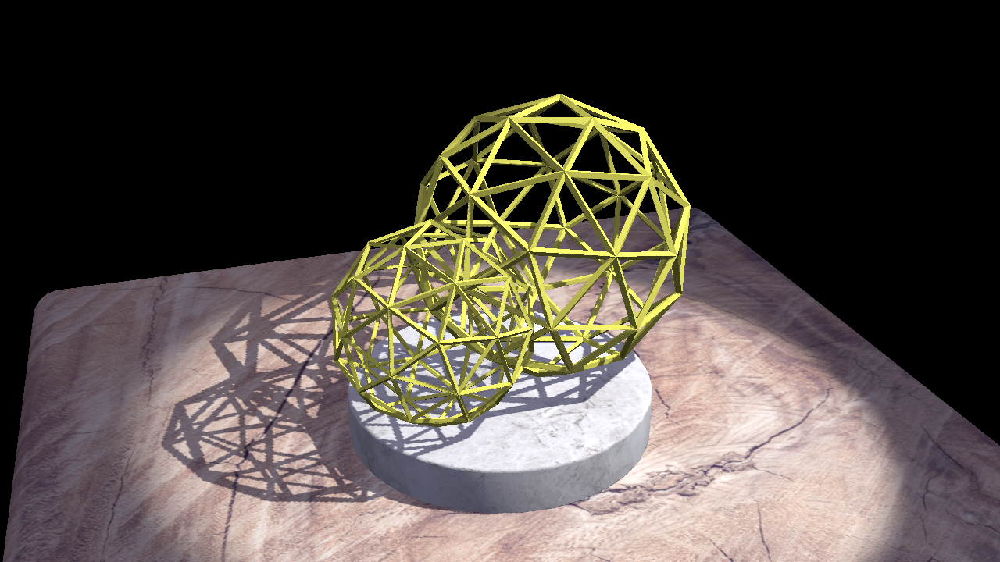

# 15-466 Shadow Map Demo

This code demonstrates using a shadow map to compute visibility of a spotlight from arbitrary points in the scene. It is a modified version of [15-466-f25-base2](https://github.com/15-466/15-466-f25-base2), including updated example code from [15-466-f18-base3](https://github.com/ixchow/15-466-f18-base3).

## To Adjust

Shadow maps generally take some tuning to look right.
I encourage you to play with the shadow map resolution (second parameter to `fbs.allocate`) and the bias (see the comment `/* <-- bias */` in the computation of `spot_from_world`) to see what sorts of artifacts they cause/fix.

This is using 4-tap PCF (percentage-closer filtering) -- a very simple shadow map smoothing strategy.
Notice the obvious jagged edges.

This code supports only one shadow map. Using more (without moving to a multi-pass render) can be done by using a "shadow map atlas", where each light uses its own region of the shadow map; or by using a layered texture where each light gets its own layer of the shadow map.

This code only deals with shadow mapping from spot lights. Supporting point lights can be done with shadow cube maps. Supporting distant directional lights can be done by modifying the projection computation (though, generally, for large outdoor scenes you'll want something like cascaded shadow maps to get an acceptable balance of resolution over the whole scene).

## Implementation Notes

The main driver of the demo is `ShadowMapDemoMode`; if you look at its `draw` function you will see that it first renders the scene to a depth texture from the point of view of the spotlight (using some new helpers in `Scene`), then does the main render, using this shadow map for depth testing.

Things to pay particular attention to:
- The texture type used for the shadow map.
- How that texture is bound to the framebuffer for rendering the shadow map.
- How that texture is bound for sampling (including the sampler type in the glsl code itself -- see `ShadowedColorTextureProgram`.

This game was built with [NEST](NEST.md).
